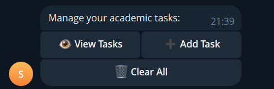
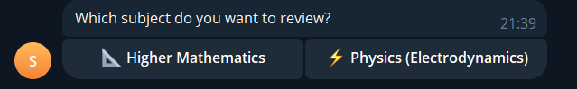

# 🤖 Student Assistant Bot

## 📝 Project Description
**Student Assistant Bot** is a multi-functional Telegram application developed in Python as a final course project. The application serves as an interactive digital assistant designed to automate daily tasks for university students and optimize their learning workflow.

**Core Features:**
* **Interactive To-Do List (Task Manager):** Allows students to add, view, and clear academic tasks (deadlines, lab reports, homework assignments) with persistent server-side storage.
* **Academic Reference Guide (Cheatsheets):** Instant access to core formulas in Higher Mathematics (integrals, derivatives) and Physics (Ohm's law, Kirchhoff's rules) via user-friendly inline keyboards.
* **Language Module (English Boost):** A curated selection of academic collocations to improve speaking and writing skills.
* **Student City Guide (Almaty Locations):** A quick reference directory of student-friendly spots (quiet study paths, libraries, cultural landmarks).
* **Built-in Expression Calculator:** Safe evaluation of mathematical equations directly in the chat with automated input validation.

---

## 🛠️ Technologies Used
The project is built on a modern, decoupled tech stack ensuring high modularity and data safety:
* **Programming Language:** `Python 3.10+` — Core application logic.
* **API Framework:** `pyTelegramBotAPI (Telebot) v4.12.0` — Handling commands, messages, and inline callbacks.
* **Database Management System:** `PostgreSQL` — Production-grade relational database for reliable storage of user profiles and tasks.
* **Database Driver:** `psycopg2-binary v2.9.9` — Adapter for secure, parameterized SQL query execution.

---

## 📥 Installation Guide

Follow these steps to deploy the project locally:

1.  **Clone the Repository:**
    Ensure all codebase structures (`bot.py`, `config.py`, `requirements.txt`, `handlers/`, and `database/` folders) are placed in your working directory.
2.  **Set Up a Virtual Environment (Recommended):**
    ```bash
    # For Windows:
    python -m venv venv
    .\venv\Scripts\Activate.ps1

    # For macOS / Linux:
    python3 -m venv venv
    source venv/bin/activate
    ```
3.  **Install Dependencies:**
    Install all required libraries using the python package manager:
    ```bash
    pip install -r requirements.txt
    ```

---

## 🚀 Deployment & Execution

1.  **Configure PostgreSQL Database:**
    * Ensure your PostgreSQL server instance is active.
    * Create a new empty database via pgAdmin or your terminal:
        ```sql
        CREATE DATABASE student_bot_db;
        ```
2.  **Environment Setup (`config.py`):**
    Open `config.py` and provide your unique HTTP API token from `@BotFather`, alongside your local PostgreSQL server credentials:
    ```python
    BOT_TOKEN = "YOUR_TELEGRAM_BOT_TOKEN"

    DB_NAME = "student_bot_db"
    DB_USER = "postgres"
    DB_PASSWORD = "your_postgres_password"
    DB_HOST = "localhost"
    DB_PORT = "5432"
    ```
3.  **Run the Bot Application:**
    Execute the master script within your active terminal:
    ```bash
    python bot.py
    ```
    Upon launch, the application will connect to the PostgreSQL instance, automatically generate relational tables (`users`, `tasks`) utilizing structured `FOREIGN KEY` references, and start polling updates.

---

## 📊 Bot Interaction Examples

User interaction is built around structured command inputs and explicit GUI reply elements:

* **`/start` Command:** Registers the Telegram user inside the PostgreSQL tables using `ON CONFLICT DO NOTHING`, delivers an onboarding text, and triggers the `ReplyKeyboardMarkup` interface.
* **`📝 My Tasks` Action:** Generates inline context choices. Choosing "Add Task" alters the state machine to capture subsequent text inputs, routing data directly to an SQL `INSERT` parameter function.
* **`📚 Cheatsheets` Action:** Provides discrete subjects. Selecting a topic responds with clean, markdown-formated monospaced formula tables for comfortable reading.
* **`🧮 Calculator` Action:** Intercepts arithmetic operations, safely checks for unverified symbol strings, and solves equations using isolated code blocks. Built-in exception handling triggers graceful error alerts on zero division or invalid characters, keeping the runtime polling alive.

---

## 📸 Interface Screenshots

*Visual breakdown of the Telegram Bot user interface components:*

<h4>Main Application Hub Menu:</h4>


<h4>Database To-Do Management Panel:</h4>


<h4>Academic Formula Lookups:</h4>
